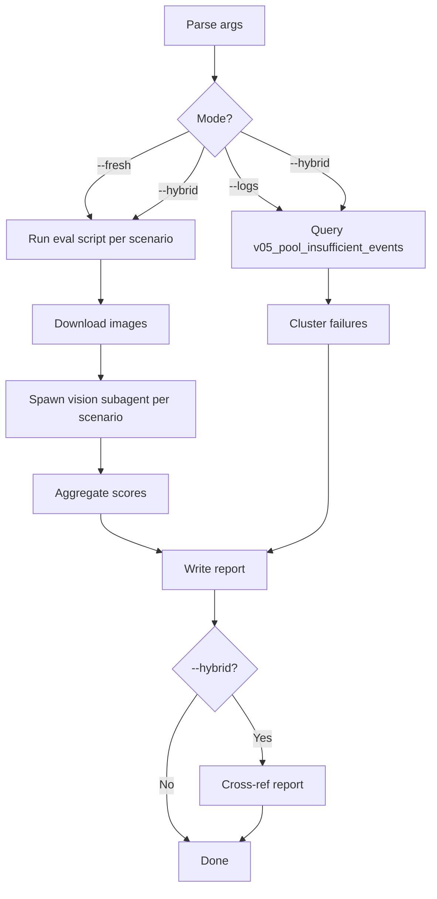

# V05 Eval

End-to-end QA harness for the V05 outfit recommendation engine. Replaces the manual eval workflow (login → build → try_another × N → download images → score) with one command.

**Backend repo**: `wardrobe-backend/` (FastAPI · SQLAlchemy · Postgres)
**Engine**: `blueprints/recommendation/engine_v05.py`
**Eval data**: `eval_runs/<timestamp>/` per run; `v05_pool_insufficient_events` table in DB

## When to use

- After changing engine logic — verify no regression across climate × gender × occasion matrix
- After data layer changes (seeder, common items) — measure UX impact
- Before shipping new V05 feature — surface failure patterns in advance
- Periodically (weekly) — mine DB log for new failure clusters → feed into Linear backlog

## Try-another success metric (distinctness — since 260611, replaces axis success)

A `try_another` call **succeeds** when the response outfit is non-null AND
`trace.min_distance ≥ trace.distance_floor` AND `fallback_flags` contains none of
{`relaxed_distance`, `variations_cycled`, `exclude_relaxed`}. Terminal
"no more variations" calls are counted separately (report both incl./excl., FU-04 framing).
Report alongside: distance histogram, relaxed/cycled/terminal rates, reseed evidence
(pool growth), and zero unflagged repeated `outfit_hash` per session (hard fail).
Targets: fresh-pool ≥85% · full 10-call session ≥80% · p95 ≤2.5s · zero 5xx.
Reference run: `wardrobe-backend/plans/reports/v05-eval-260611-diversity-try-another.md`.

## Three modes

### `--fresh` — Run new eval matrix (default if no flag)

1. Login as qa-test account
2. For each scenario (gender × temp × occasion × mood):
   - POST `/api/v05/recommendation/build`
   - Cycle 4-10 `try_another` calls (distance-based diversity — no axis param since 260611)
   - Download item images locally
3. Spawn multimodal subagent per scenario → read images + score per rubric
4. Aggregate report → `wardrobe-backend/plans/reports/v05-eval-<date>-fresh.md`

### `--logs` — Mine PoolInsufficient DB events

1. Query `v05_pool_insufficient_events` for last N days (default 7)
2. Cluster by:
   - `climate_bucket × gender × starved_family`
   - Top `failure_reason` counts
   - Per-user repeat failures
3. Surface action-able findings:
   - "M @ COOL → FOOTWEAR starvation, 45 events, SYS catalog has 1 boot → seed gap"
   - "W @ HOT → BOTTOM starvation, 12 events → catalog audit"
4. Write report → `wardrobe-backend/plans/reports/v05-eval-<date>-logs.md`
5. Optionally output Linear ticket drafts to `wardrobe-backend/plans/reports/v05-eval-<date>-linear-drafts.md`

### `--hybrid` — Fresh + cross-ref with logs

Both modes, plus cross-reference:
- "Live eval says M @ 22°C casual works. DB log says 18 failures at same input — possible regression OR rate-limit failures? Investigate."
- Catch silent regressions where fresh eval passes but prod log shows failures.

## Arguments

| Flag | Default | Effect |
|---|---|---|
| `--fresh` | (default) | Live eval scenarios |
| `--logs` | — | Mine DB events only |
| `--hybrid` | — | Both + cross-ref |
| `--count N` | 5 | TA calls per scenario |
| `--scenarios "M/30/casual,W/5/work,..."` | default matrix (see references/scenarios.md) | Override scenario set |
| `--days N` | 7 | Lookback window for `--logs` |
| `--user EMAIL` | qa-test@auxi.app | Eval account |
| `--rubric PATH` | references/rubric.md | Override rubric file |
| `--skip-images` | — | Skip multimodal vision review (faster, less thorough) |

## Process flow



## Execution steps (orchestrator follows this)

### Step 1 — Pre-flight check
```bash
# Backend running?
curl -s -m 3 -o /dev/null -w "%{http_code}" http://localhost:5001/health
```
If not 200 → STOP, ask user to start backend.

### Step 2 — `--fresh` per-scenario loop

For each scenario in matrix (or `--scenarios` override):
```bash
cd wardrobe-backend
.venv/bin/python scripts/eval_v05_outfits.py \
  --email <user> --password <pw> \
  --count <count> \
  --temp-c <T> --gender <G> --occasion <O> [--mood <M>]
```
Capture `eval_runs/<ts>/outfits.json`. If `--skip-images`, stop here.

### Step 3 — Download images
The eval script saves `outfits.json` with `image_url` per item. Download to `eval_runs/<ts>/images/outfit_NN/MM_CATEGORY_<id8>.jpg`.

### Step 4 — Spawn fashion judge subagent per scenario
Per `eval_runs/<ts>/`:
- Spawn `general-purpose` agent (has Read tool — reads images natively)
- Agent MUST invoke `Skill("v05-fashion-judge")` before scoring
- Pass to agent: list of image paths + eval context (gender, temp_c, occasion, mood, style_direction, is_rainy, is_try_another, previous_outfits)
- Agent returns structured JSON: per-outfit scores (schema defined in `v05-fashion-judge` skill)
- Do NOT pass the raw rubric inline — the skill loads rubric and calibration anchors itself

### Step 5 — `--logs` DB mining (if applicable)
```python
# Query via SQLAlchemy
SELECT climate_bucket, gender, failure_reason, COUNT(*)
FROM v05_pool_insufficient_events
WHERE created_at > NOW() - INTERVAL '<days> days'
GROUP BY 1, 2, 3 ORDER BY 4 DESC;
```
See `references/analytics-queries.sql` for full query set.

### Step 6 — Aggregate report
Write to `wardrobe-backend/plans/reports/v05-eval-<YYMMDD-HHMM>-<slug>.md`. Template in `references/report-template.md`.

### Step 7 — `--hybrid` cross-ref
Compare fresh eval results with log clusters. Surface mismatches.

## Loaded references

Load these on demand:
- `references/rubric.md` — eval rubric for multimodal vision scoring
- `references/scenarios.md` — default scenario matrix
- `references/analytics-queries.sql` — SQL queries for log mining
- `references/report-template.md` — markdown report skeleton

## Constraints

- **Read-only on engine code**: skill never modifies production code. Findings only.
- **Read-only on DB**: queries only, no DELETE/UPDATE on `v05_pool_insufficient_events`.
- **Rate limit aware**: eval script has 429 auto-retry. Skill should space scenarios ≥ 10s apart.
- **No mocking**: real backend, real DB. If backend hung, abort + report.
- **PII**: only `user_id` UUID. Don't log/render emails or item names in reports.

## Rubric source

Rubric is **official** — approved by Viet (AU-259, 2026-05-13). See `references/rubric.md`.

The rubric is **system-agnostic**: it evaluates outfit quality regardless of which recommendation engine produced the outfit. When the engine changes (V05 → V06 → any future engine), update the API calls in Step 2 but keep `references/rubric.md` unchanged.

To override rubric for a specific run: `--rubric <path>`

## Output examples

### `--fresh` report excerpt
```markdown
# V05 Fresh Eval — 260513-2152

## Outcome matrix (3 scenarios, 5 calls each = 15 outfits)

| Scenario | Build | TA success | Avg coherence | Common-essential injected |
|---|:---:|:---:|:---:|:---:|
| M / 22°C / casual | ✅ | 1/4 | 3.3/5 | 0 outfits |
| W / 15°C / confident | ✅ | 4/4 | 4.1/5 | 0 outfits |
| M / 5°C / casual | wardrobe_gap | — | — | — (gap) |
```

### `--logs` report excerpt
```markdown
# V05 Log Mining — last 7 days

## Top failure patterns

| Cluster | Count | Suggested action |
|---|---:|---|
| M × COOL × FOOTWEAR starvation | 45 | AU-260 seed M boots (in flight) |
| W × HOT × BOTTOM starvation | 12 | Catalog audit needed |
| _ × MILD × no_outfits_after_L2 | 8 | Engine bug — L2 visual_weight cap binding |
```

## Workflow position

**Typically follows**: implementation changes to any recommendation engine, seeder, or data layer
**Typically precedes**: `/ck:plan` for fix work surfaced by eval findings
**Related**: AU-259 (rubric — closed, official), AU-260 (catalog seed)

## Known limitations

1. Multimodal scoring is rubric-dependent — quality bounded by rubric quality. Rubric is now official (Viet, AU-259).
2. DB mining requires `DATABASE_URL` in `.env`. Skill assumes prod-equivalent DB access.
3. `--hybrid` cross-ref logic is simple (mismatch detection); future refinement may need ML.
4. Vision subagent ~2-3 min per scenario. 5 scenarios = 10-15 min total.
